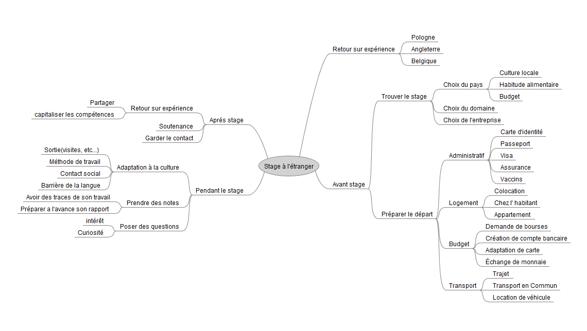

Suite à notre retour de stage à l'étranger et dans le but d'établir un groupe de travail collaboratif, nous avons défini des régles de gestion et des outils à mettre en place pour permettre de partager notre expérience et aider les étudiants dans leurs recherches de stage à l'étranger. 

Pour se faire, nous avons établi ce wiki disponible pour tous, qui comprend différents retours de notre part, des astuces et bonnes pratiques pour préparer son stage à l'étranger et ne pas avoir de mauvaise surprise.
    
Au départ de ce projet nous avons établi un Mind mapping de tous les points à restituer pour avoir une vue globale de ce qui pourrait être utile à tout étudiant rentrant dans cette démarche.
    
    
    
    
*Écrit par le groupe Réseau des A4.*